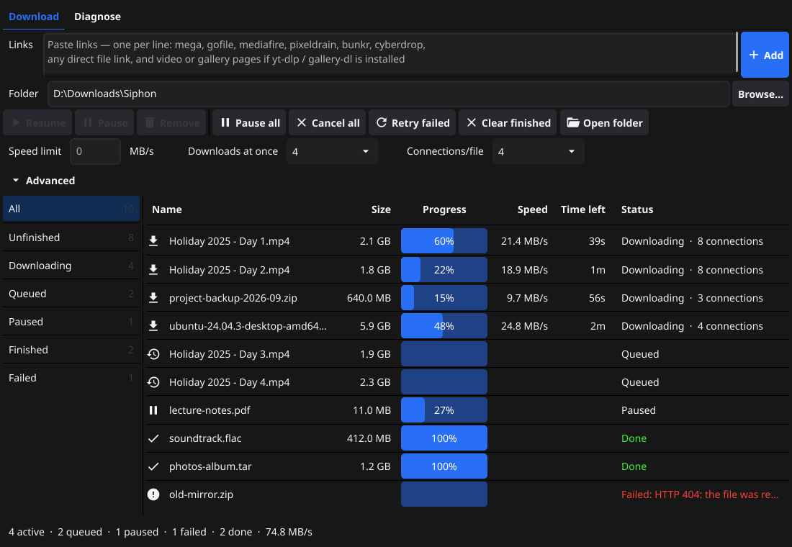

# Siphon

[](https://github.com/mustafaberatdemirci/siphon/actions/workflows/ci.yml)
[](https://github.com/mustafaberatdemirci/siphon/releases/latest)
[](LICENSE)

**A fast, single-file downloader for mega.nz, gofile, mediafire, pixeldrain,
bunkr, cyberdrop and direct links.** No Java, no Python, nothing to install:
download one file and run it.
With yt-dlp or gallery-dl installed, it also queues video and gallery pages
from [thousands more sites](#thousands-more-sites-through-yt-dlp-and-gallery-dl).

- **mega over 8 connections**, decrypted on the fly, and when the transfer
  quota runs out it **resumes by itself seconds after you switch VPN
  servers**.
- **A persistent queue** in a window: pause, resume, cancel, several downloads
  at once; closing the window keeps it running in the notification area.
- **It tells you why a site stopped working.** `siphon doctor` checks each site
  layer by layer (DNS, TLS, Cloudflare challenge, fetch, parse, item page,
  CDN) and names the layer that broke, instead of "0 files downloaded".

<p align="center">
  
</p>

It comes as two programs that share one download pipeline:

- **`siphon-gui`**: a window with a persistent download queue (IDM-style).
- **`siphon`**: a command-line tool for scripts and batch runs.

## Install

Download the archive for your system from the
[latest release](https://github.com/mustafaberatdemirci/siphon/releases/latest),
unpack it and run `siphon-gui` (or `siphon` in a terminal). Each program is a
single file; there is nothing to install. `SHA256SUMS.txt` lists the
checksums of every archive.

- **Windows:** SmartScreen may warn about an unknown publisher the first
  time; choose *More info → Run anyway*.
- **macOS:** the binaries aren't signed; the first time, right-click
  `siphon-gui` and choose *Open*, or run
  `xattr -d com.apple.quarantine siphon-gui`.
- **Linux:** the window version needs the OpenGL, X11 and Wayland client
  libraries, present on any desktop install.

To build it yourself instead, see [Building](#building).

## Features

- **Resumable downloads.** Progress lives in a `.part` file and a
  `.part.state` sidecar. Interrupted downloads continue where they stopped,
  even after a crash. `If-Range` is used so that pieces of two different
  versions of a file are never glued together. Where the server names no
  version but the site gives the file's SHA-256 (mediafire), the hash plays
  that role: it is checked over the finished file.
- **Several downloads, several connections each.** Several files download at
  once (4 by default), and a large file is split into chunks fetched over
  several connections. A connection that finishes its chunk takes the next
  one, so all of them stay busy until the end of the file. The number of
  connections drops by itself when a server answers `503`/`429`. See
  [Connections per file](#connections-per-file).
- **Integrity checks.** Every file is hashed with SHA-256, and compared with
  the site's hash when it gives one. mega files are also checked against
  their meta-MAC.
- **mega.nz decryption.** mega files are encrypted on your side. Siphon
  decrypts them while downloading (AES-128-CTR) using only Go's standard
  library, so plaintext is written to disk.
- **Quota handling (mega).** When mega's per-IP transfer quota runs out:
  - the affected jobs wait instead of failing;
  - Siphon checks every 10 seconds whether the quota has opened, so the
    downloads continue by themselves within seconds of a VPN server switch
    (or when the quota resets);
  - it can optionally run your own "switch VPN" command.
- **Domain rotation (bunkr).** When a bunkr domain is blocked, Siphon moves
  on to the next one. It recognizes a block whether it shows up as a DNS
  failure, a certificate error, a connection timeout or a Cloudflare
  challenge. Blocked domains are retried later.
- **No duplicates.** A `done.jsonl` ledger in the output folder records what
  was downloaded, so running the same links again skips finished files. It
  only skips a file that is still on disk.
- **Safe file names on Windows.** Siphon handles reserved device names
  (`CON`, `NUL`, `COM1`, …), trailing dots and spaces, and the 255-character
  limit per path component.
- **Site definitions in a TOML file.** The site definitions are embedded in
  the binary, and a `sites.toml` next to the exe can override them. When a
  site adds a domain or moves an endpoint, you edit a file instead of
  waiting for a new release.

## Supported links

| Site | Links |
| --- | --- |
| mega | `mega.nz/file/<id>#<key>`, `mega.nz/folder/<id>#<key>` (with subfolders), and the legacy `#!` / `#F!` forms |
| gofile | `gofile.io/d/<id>` (with subfolders; `?password=…` for a protected folder), and download server links |
| mediafire | `mediafire.com/file/<key>`, `mediafire.com/?<key>`, `mediafire.com/folder/<key>` (with subfolders), and download server links |
| pixeldrain | `pixeldrain.com/u/<id>` (file), `pixeldrain.com/l/<id>` (list), and the mirror domains |
| bunkr | `bunkr.*/a/<id>` (album), `bunkr.*/f/<id>`, `/v/`, `/i/` (single file), across the known bunkr domains |
| cyberdrop | `cyberdrop.cr/a/<id>` (album), `cyberdrop.cr/f/<id>` (file), the old `.me` / `.to` domains, and download server links |
| Any direct file link | `https://example.com/files/setup.zip`, or a link that redirects to a file |

Subfolders become folders on disk, under a folder named after the album or
the top folder.

A few site notes:

- **gofile** only lists files to an account. Siphon makes a guest account
  and reuses it for a day (gofile limits how often those can be made); to
  use your own account, put its token in `sites.toml` (see
  [Configuration](#configuration)).
- **cyberdrop** files download over one connection and start over if
  interrupted: its servers name no file version and it gives no hash, so
  pieces fetched at different times couldn't be proven to match.

A direct file link is anything the sites above don't recognize. Siphon asks
the server for the file's first byte to learn its name and size, then
downloads it like any other file: resumable, over several connections when
the server supports ranges, and recorded in the ledger. The name comes from
the server's `Content-Disposition`, otherwise from the URL.

Two kinds of links are never saved as a file:

- A link that opens a **web page**. Saving a login or "file not found" page
  as "the file" would look like a success. A page may still be a video or a
  gallery, though: see below.
- A link on one of the sites above that the site doesn't recognize, such as a
  mega link with a truncated key or a mega storage URL. As a plain file it
  would be a web page or encrypted bytes.

### Thousands more sites through yt-dlp and gallery-dl

If [yt-dlp](https://github.com/yt-dlp/yt-dlp) (video and audio, about 1,800
sites) or [gallery-dl](https://codeberg.org/mikf/gallery-dl) (images and
galleries, about 300 sites) is installed, a web page link goes to them:
yt-dlp first, then gallery-dl.

- A video becomes one job. A playlist or channel becomes one job per video,
  in a folder named after the playlist. A gallery becomes one job.
- The tool does the downloading; Siphon runs it in the queue, shows its
  progress, and records the result in the ledger, so the next run skips it.
  Pause stops the tool, and resuming continues its partial file.
- **Installing them is one click:** **Diagnose → Install tools…** (or
  `siphon tools install`). Siphon lists what it can install with the sizes,
  and only after you confirm downloads each tool from its own official
  release, checks it against the SHA-256 published with that release, and
  puts it in `%AppData%\Siphon\tools`. Nothing is installed if a check fails;
  to update a tool, install it again. On Windows that covers yt-dlp, ffmpeg,
  gallery-dl and deno; on Linux and macOS, use your package manager for the
  ones Siphon doesn't offer (ffmpeg, and gallery-dl on macOS).
- Siphon doesn't bundle them. Tools you install yourself work too: next to
  Siphon, on your PATH, or at paths set in `sites.toml` (the `direct` entry).
  `siphon tools` (or the **Diagnose** tab) lists which ones were found.
- Install **ffmpeg** too if you download video: many sites (YouTube among
  them) send picture and sound separately, and only ffmpeg can merge them.
  Without it, Siphon asks yt-dlp for the best single file that has both, and
  when there is none says so and points to Install tools; it never hands over
  the sound alone.
- To send a link to one tool on purpose, put its name in front:
  `yt-dlp:https://…` or `gallery-dl:https://…`.

yt-dlp's own requirements apply: for YouTube, for example, it wants a
JavaScript runtime (deno, one of the tools Siphon can install) to see every
format.

## Building

Requirements:

- Go 1.27 or newer.
- For the GUI only: a C compiler, because Fyne uses cgo. On Windows, MinGW-w64
  works. On Debian or Ubuntu:
  `sudo apt install gcc libgl1-mesa-dev xorg-dev libxkbcommon-dev libwayland-dev`.

```sh
# Command-line tool (static, no cgo needed)
go build -o siphon.exe .

# Window version (-H=windowsgui hides the console window on Windows)
go build -ldflags -H=windowsgui -o siphon-gui.exe ./cmd/siphon-gui
```

Each result is a single file with the site definitions embedded; nothing
else needs to be installed. Live testing happens on Windows; CI builds and
tests Linux and macOS too.

## Using the window version

1. Paste links into the **Links** box (one per line; blank lines and lines
   starting with `#` are ignored) and press **Add**.
2. Siphon resolves each link and queues its files. The queue is saved, so
   closing and reopening the app keeps the list, and unfinished downloads
   continue where they stopped.

The queue is a table: name, size, progress, speed, time left and status,
with the connections each download really has. Click a column title to sort
by it (again to reverse, a third time for queue order; names sort the way
people number them, `Day 2` before `Day 10`). The list on the left filters
it: all, unfinished, downloading, queued, paused, finished, failed.

- **Select** rows with a click, several with Ctrl-click, a range with
  Shift-click, all shown with Ctrl+A.
- **Right-click** for resume, pause, show in folder, show error, copy link
  and remove, acting on every selected row. **Delete** removes them too; if
  any has a partial file, Siphon asks first and offers to delete it.
- **Double-click** a finished row to show the file in its folder, a failed
  one to read the whole error.

The toolbar has:

| Control | What it does |
| --- | --- |
| Resume / Pause / Remove | Act on the selected rows. |
| Pause all / Resume all | Stops starting new downloads and pauses running ones; press again to resume. |
| Cancel all | Stops and removes every unfinished download. It asks first and offers to delete the partial files. Finished files are never touched. |
| Retry failed | Puts every failed job back in the queue. |
| Clear finished | Removes finished rows from the list (the files stay). |
| Open folder | Opens the selected download's folder, or else the folder of the last finished file, with the file selected. |
| Speed limit | Total limit in MB/s across all downloads (empty or 0 = unlimited). |
| Downloads at once | How many files download at the same time (default 4). Takes effect right away. |
| Connections/file | How many connections a single file may use; also applies to downloads already running. See below. |

**Advanced → VPN switch command** is optional. It is only for mega's quota;
see [Quota handling](#quota-handling-mega).

The **Diagnose** tab runs the same layer check as `siphon doctor`.

**Closing the window doesn't stop the downloads.** Siphon hides in the
notification area next to the clock (on Windows 11 the icon may be under the
^ arrow) and keeps going. Click the icon to bring the window back; right-click
it and choose **Quit** to exit. Unfinished downloads are saved and continue
the next time you start Siphon. While downloads wait for quota the icon turns
orange. Only one Siphon runs at a time: starting it again brings up the
window that is already running.

## Using the command line

```sh
siphon [flags] [url ...]
siphon -i links.txt -out D:\Downloads
siphon --resolve-only https://pixeldrain.com/l/abc123   # print file URLs, download nothing
```

| Flag | Meaning |
| --- | --- |
| `-i <file>` | Read URLs from a file (one per line, `#` for comments). |
| `-out <dir>` | Output root (default: the current directory). |
| `-c <file>` | Use this `sites.toml` (see [Configuration](#configuration)). |
| `-v` / `-q` | More detail / only errors. |
| `-resolve-only` | Print the resolved download URLs and exit; the disk is not touched. |
| `-on-quota "<command>"` | Run this command when a site's quota runs out, then continue (at most 5 rounds). |

Exit codes:

| Code | Meaning |
| --- | --- |
| 0 | Everything resolved and downloaded. |
| 1 | Partial: some items failed, a URL was skipped, or the run was interrupted (Ctrl+C). |
| 2 | No URL could be resolved. |
| 3 | Usage or configuration error (bad flags, invalid TOML, unreadable input file). |

Press Ctrl+C to stop. Partial files are left consistent and continue on the
next run.

### External tools: `siphon tools`

```sh
siphon tools                    # which of yt-dlp, gallery-dl, ffmpeg, deno were found
siphon tools install            # install the missing ones (official releases, SHA-256 checked)
siphon tools install yt-dlp     # install or update one
```

### Diagnosing a site: `siphon doctor`

```sh
siphon doctor              # every site
siphon doctor bunkr -v     # one site, with details
siphon doctor bunkr -canary https://bunkr.example/a/abc   # check a specific album
```

The report has one row per layer: `DNS`, `TLS`, `Challenge`, `Fetch`,
`Parse`, `ItemPage`, `CDN`. Each row is `OK`, `WARN` or `FAIL`. If a canary
is an album or folder URL, the deeper layers are checked for real, using a
single item. The exit code is 1 if any layer failed. `WARN` does not affect
the exit code; for example, an unknown CDN host is worth knowing about but
doesn't break anything.

| Flag | Meaning |
| --- | --- |
| `-c <file>` | Use this `sites.toml`. |
| `-v` / `-q` | More detail / only errors. |
| `-canary <url>` | Check this URL instead of the configured canaries (repeatable). |
| `-record` | Save the raw responses to disk, e.g. to compare them after a site changes. |
| `-record-dir <dir>` | Where to save them (default `recordings`). |

## Connections per file

The **Connections/file** setting is a *request*. Each site has a *ceiling*
(`max_segments` in `sites.toml`), and the setting cannot exceed it:

| Site | Ceiling | Why |
| --- | --- | --- |
| pixeldrain | 1 | The free tier limits concurrent connections per IP. With a paid account and an API key you can raise it in your own `sites.toml`. |
| bunkr | 3 | Measured: the CDN answers a fourth connection to the same file with `503`, and more connections did not make downloads faster. |
| mega | 8 | Every byte range is decrypted independently. The meta-MAC is checked once over the finished file. |
| gofile | 4 | Measured: 10.4 MB/s over one connection, 12.9 MB/s over four. |
| mediafire | 4 | Its servers send no version header, but the SHA-256 from mediafire's API is checked over the finished file. |
| cyberdrop | 1 | No version header and no hash: pieces fetched at different times couldn't be proven to belong to the same file. |
| Direct file links | 4 | A common download-manager default for servers Siphon knows nothing about. |

A file is split into chunks (4–32 MiB, depending on its size) kept in a
queue. Each connection takes the next free chunk as soon as it finishes one,
so fast connections take more chunks and all of them stay busy until the end
of the file. mega's chunks are requested the way mega's own clients ask for
them, with the byte range in the URL.

Even within the ceiling, a file gets fewer connections in these cases:

- It is smaller than 8 MiB; splitting would cost more than it gains.
- The server doesn't support range requests. Siphon falls back to a single
  stream by itself.
- Other downloads are using up the connection budget for the same host
  (`max_connections`). A file never waits for another file's extra
  connections: it starts on its own connection and picks up more as they
  free up.
- The server pushes back with `503`/`429`. Parallelism then drops by one per
  complaint.

Each running row shows how many connections its download really has (for
example `8 connections`), so you can see the effective value.

## Quota handling (mega)

mega limits anonymous downloads to a transfer quota per IP address, roughly
5 GB per several hours. When it runs out:

- The affected jobs switch to **waiting for quota**; they do not fail. Jobs
  from other sites keep going.
- A banner appears above the list, the taskbar button flashes, and, if
  Windows notifications are enabled, a notification is shown.
- Every 10 seconds Siphon asks for the first byte of one waiting file. When
  a byte comes back, either the quota has reset or your IP changed (for
  example, you switched VPN servers), and **all** waiting jobs continue at
  once. mega ties each download URL to the IP that asked for it, so after a
  VPN switch Siphon gets fresh URLs by itself. **Try now** skips the wait.
- If you set a **VPN switch command** (GUI) or `-on-quota` (CLI), Siphon
  runs it when the quota runs out, at most once every two minutes. It is a
  plain shell command that you write for your own VPN client. Leaving it
  empty is fine: switch servers in your VPN app and the queue notices.

## Configuration

The site definitions are embedded in the binary. To change them, put a
`sites.toml` in one of these places, which are searched in order:

1. the path given with `-c`;
2. next to the executable;
3. the current working directory.

This file is **laid over** the embedded definitions; it does not replace
them:

- Scalar values (`max_segments`, `user_agent`, …) override the embedded
  ones.
- Lists (`domains`, `cdn_patterns`, …) are *merged* with the embedded ones.
- Entries are removed only explicitly, with `domains_remove` or
  `cdn_patterns_remove`.

So a small file with only what you want to change is enough. For example, to
add a pixeldrain API key (paid account) and allow more connections:

```toml
schema_version = 1

[[site]]
name = "pixeldrain"
max_segments = 4

[site.extra]
api_key = "your-key-here"
```

The API key is sent with HTTP Basic auth and is never logged or recorded.

A gofile account token works the same way (gofile.io → *My profile*); without
one, Siphon uses a guest account:

```toml
schema_version = 1

[[site]]
name = "gofile"

[site.extra]
account_token = "your-token-here"
```

The per-site connection settings:

| Key | Meaning |
| --- | --- |
| `max_concurrent` | Files downloaded at once from the site (per host). |
| `max_segments` | Connections per file: the ceiling of **Connections/file**. |
| `max_connections` | Connections to one host at once, the files' own connections included. Default: `max_concurrent` × `max_segments`. |
Invalid TOML is a hard error; Siphon doesn't silently fall back to the
embedded copy.

## Files Siphon writes

| File | Where | Purpose |
| --- | --- | --- |
| `<name>.part`, `<name>.part.state` | Next to the file being downloaded | Partial data and resume state; removed when the file completes. |
| `done.jsonl` | Output root | Ledger of finished downloads (used to skip them next time). |
| `queue.json` | `%AppData%\Siphon\` (the user config folder) | The GUI's queue. It holds the source links, and a mega link includes its key. |
| `instance.port` | `%AppData%\Siphon\` | While the window version runs: how a second launch finds it. Removed on exit. |
| `tools\` | `%AppData%\Siphon\` | The tools installed with **Install tools** (yt-dlp, ffmpeg, gallery-dl, deno). Delete the folder to remove them. |
| `gofile-guest.json` | `%AppData%\Siphon\` | The gofile guest account in use, reused for a day. Safe to delete. |

## What Siphon does not do

- **No captcha solving.** When a site asks for a captcha (pixeldrain does
  this per file), Siphon stops that site's downloads and tells you. Retrying
  would only make it worse.
- **No gaming of access controls.** For example, it doesn't inflate view
  counts, and it doesn't use public proxy lists. Per-site limits are
  respected, not circumvented.

## Development

```sh
go vet ./...
go test -race ./...
```

The tests run offline against local `httptest` servers. They cover the
resolvers, resume and segmented downloads, the mega crypto, the queue engine
and the GUI's view model. `-race` needs cgo, which means a C compiler. CI runs
them on Windows, Linux and macOS for every push and pull request.

A few tests check the real sites (mediafire, gofile, cyberdrop) with public,
neutral links and download next to nothing. They are skipped unless asked
for:

```sh
SIPHON_LIVE=1 go test ./internal/site -run Live -v
```

The screenshot above is drawn by a test, off screen, with sample jobs; after
changing the window, regenerate it with
`SIPHON_SCREENSHOT=1 go test ./cmd/siphon-gui -run READMEScreenshot`.

**Releasing:** add a `## 1.0.0` section to [CHANGELOG.md](CHANGELOG.md),
then push a tag such as `v1.0.0`. The release workflow builds both programs
for Windows, Linux and macOS, stamps the version into them
(`siphon -version`) and publishes the archives with their checksums, with
that section as the release notes.

## Responsible use

Siphon downloads what the sites serve to anyone with the link; it doesn't
bypass logins, paywalls, DRM or captchas. You are responsible for respecting
copyright and each site's terms of service.

## License

[MIT](LICENSE)
